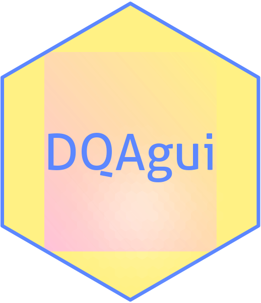

# DQAgui 

<!-- badges: start -->

    Warning: `git_branch_default()` was deprecated in usethis 2.1.0.
    ℹ Please use `git_default_branch()` instead.
    ℹ The deprecated feature was likely used in the badger package.
      Please report the issue at <https://github.com/GuangchuangYu/badger/issues>.

[](https://lifecycle.r-lib.org/articles/stages.html#experimental)
[](https://cran.r-project.org/package=DQAgui)
[](https://cran.r-project.org/web/checks/check_results_DQAgui.html)
[](https://cran.r-project.org/package=DQAgui)
[](https://cran.r-project.org/package=DQAgui)
[](https://cran.r-project.org/package=DQAgui)
[](https://github.com/miracum/dqa-dqagui/actions)
[](https://github.com/miracum/dqa-dqagui/actions)
[](https://github.com/miracum/dqa-dqagui/actions)
[](https://app.codecov.io/gh/https://github.com/miracum/dqa-dqagui)
[](https://doi.org/10.1186/s12911-022-01961-z)

<!-- badges: end -->

This is the repository of the R package ‘DQAgui’. It provides a
graphical user interface to the functionalities implemented in
[`DQAstats`](https://github.com/miracum/dqa-dqastats).

## Installation

You can install `DQAgui` with:

``` r
install.packages("remotes")
remotes::install_github("miracum/dqa-dqagui")
```

## Configuration

The database connection can be configured using environment variables.
These can be set using the base R command `Sys.setenv()`.

A detailed description, which environment variables need to be set for
the specific databases can be found
[here](https://github.com/miracum/misc-dizutils#db_connection).

## Example

This is a basic example to demonstrate how to perform the data quality
assessment with `DQAgui`:

``` r
library(DQAgui)

# define base paths for shinyFiles::shinyDirChoose
Sys.setenv(
  "CSV_SOURCE_BASEPATH" = system.file("demo_data", package = "DQAstats")
)
Sys.setenv(
  "CSV_TARGET_BASEPATH" = system.file("demo_data", package = "DQAstats")
)

# define path to utilities-folder
utils_path <- system.file("demo_data/utilities",
                         package = "DQAstats")

# filename of the metadata repository
mdr_filename <- "mdr_example_data.csv"

# directory for storing logfiles
logfile_dir <- tempdir()

launch_app(
  port = 3838,
  utils_path = utils_path,
  mdr_filename = mdr_filename,
  logfile_dir = logfile_dir,
  parallel = FALSE
)
```

To open the shiny application in your web-browser, go to
`localhost:3838`.

## Demo Usage / Deployment Examples

You can test the package without needing to install anything except
[docker](https://docs.docker.com/get-docker/). :bulb: For further
details, see the
[Wiki](https://github.com/miracum/dqa-dqastats/wiki/Deployment#dqagui-browser-based-gui-version-of-the-dqa-tool).

## More Infos

- about MIRACUM: <https://www.miracum.org/>
- about the Medical Informatics Initiative:
  <https://www.medizininformatik-initiative.de/index.php/de>
- about Shiny: <https://www.rstudio.com/products/shiny/>
- RStudio and Shiny are trademarks of RStudio, Inc.
